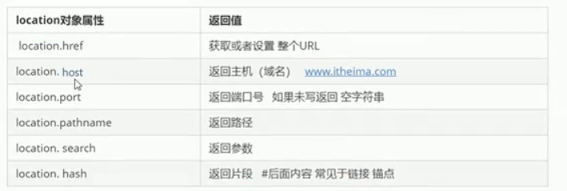

##事件冒泡与事件捕获
事件从小到大依次执行为事件冒泡;
从大到小为事件捕获；
onclick与attachEvent只能得到冒泡；
只有addEventListener既可以得到冒泡又可以得到捕获；
若addEventListener第三个参数为true,那么事件处于捕获阶段；
```
element.addEventListener('click',function(),true);
```
若addEventListener第三个参数为false或为空值时,那么事件处于冒泡阶段；
```
element.addEventListener('click',function(),false);
```

##事件委托
不用给每个节点设置事件监听器，而是把事件监听器给其父级，然后利用冒泡原理来影响子节点

##鼠标事件
.png)
##键盘事件
.png)
###keyCode
通过keyCode来获取键盘对应的ASCLL值，来判断用户按的是什么键
```
 document.addEventListener('keydown', function(e) {
            alert(e.keyCode);
        })
```
#BOM
即浏览器对象模型，他提供了独立于内容而与浏览器窗口进行交互的对象，其核心是**window**；
####dom与bom的区别
.png)
####因浏览器窗口的大小变化触发事件
```
window.addEventListener('resize',function(
   if( window.innerWidth<1000){
       某某隐藏或显现
   }
))；
```
###定时器
window.setTimeout(function(){},延迟时间毫秒数)
在延迟毫秒数后执行函数
window.setInterval(function(){},延迟时间毫秒数)
在延迟毫秒数后重复调用同一个函数

window可以省略，函数可以直接写函数名或写函数，或者采取'函数名()'三种形式，第三种不推荐,
###location对象

##元素偏移量offset
.png)
